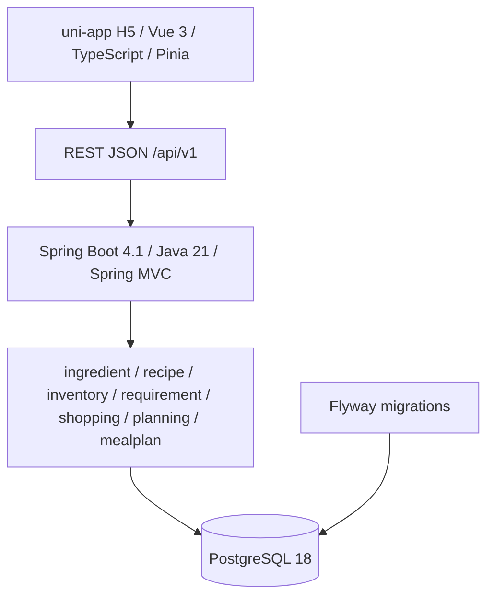

# MealOps V1 系统架构

## 文档目的

本文档同步至 Node 14：Deterministic Candidate Scoring & Ranking，记录当前模块边界、依赖方向和运行关系。

## 当前架构状态

当前能力链：

```text
Planning Preferences
        ↓
Hard Constraint Filter
        ↓
Eligible Recipe Candidates
        ↓
Transparent Scoring / Deterministic Ranking
       ↙                 ↘
defaultServings     Accounting Inventory
        ↓
Future Planner
        ↓
MealPlan
```

Node 13 使用 `maxCookingMinutes` 与 `excludedIngredientIds` 进行纯 Java 硬约束过滤。Node 14 只对 eligible candidates 评分：`defaultServings` 驱动 Recipe scaling，当前 accounting Inventory 产生逐食材覆盖率和缺口行数，再按 coverage DESC、shortage count ASC、estimated minutes ASC、recipe ID ASC 排序。该覆盖率不是 food-safety coverage；过期但仍为正数的批次继续计入 accounting availability。Node 14 没有 opaque total score 或权重，不写 MealPlan 或 Inventory。Node 12 MealPlan 仍只能通过手动 API 创建和显式分配 Recipe；Planner 尚未实现。

## 模块与依赖

MealOps 采用前后端分离的模块化单体：



Controller 只负责协议适配和输入校验；Application Service 负责用例编排和事务边界；Domain 包含可测试业务不变量；Infrastructure 负责 MyBatis 和显式 SQL。依赖方向为 API → Application → Domain，Infrastructure 通过端口适配 Application。

## MealPlan 边界

Node 12 持久化 MealPlan aggregate 和显式 MealSlot。计划窗口为 1～3 天，Slot 按日期及 BREAKFAST/LUNCH/DINNER 稳定排序。创建始终为 DRAFT，DRAFT 支持全量替换；Confirm 要求所有 Slot 已分配 Recipe；DRAFT/CONFIRMED 可 Cancel。Node 12 不应用 Planning Preferences，不生成计划候选，不修改 Shopping 或 Inventory。

## 基础设施与测试

Flyway 管理全部 schema migration，最新仍为 V6；Node 14 的 ranking 是派生只读结果，不创建 V7。数据库约束、事务、Mapper 和生命周期 SQL 使用真实 PostgreSQL 集成测试；Testcontainers 提供 PostgreSQL 18.4 测试实例。

V1 当前不存在 Redis、MQ、LLM、Agent、Planner 或前端工程实现。

## 后续方向

Future Planner 将消费 eligible candidates 与 Node 14 ranking 并生成候选 MealPlan；该能力不属于 Node 14，须在后续节点通过 ADR 决定。
