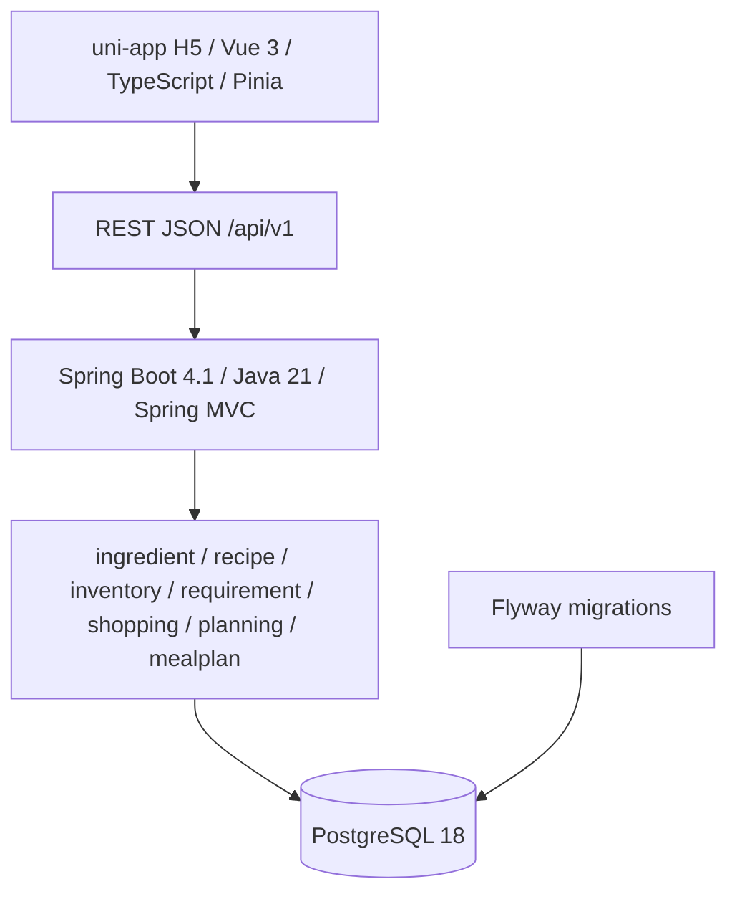

# MealOps V1 系统架构

## 文档目的

本文档同步至 Node 12：Meal Plan & Meal Slot Lifecycle，记录当前模块边界、依赖方向和运行关系。

## 当前架构状态

当前能力链：

```text
Planning Preferences
        ↓
Future Planner
        ↓
Meal Plan / Meal Slots
```

MealPlan 当前支持手动 API 创建，Recipe 由客户端显式分配；支持 DRAFT 全量替换、Confirm 和 Cancel。Planning Preferences 尚未应用，Planner 尚未实现，Shopping / Inventory 未联动，没有 COMPLETED workflow。

## 模块与依赖

MealOps 采用前后端分离的模块化单体：



Controller 只负责协议适配和输入校验；Application Service 负责用例编排和事务边界；Domain 包含可测试业务不变量；Infrastructure 负责 MyBatis 和显式 SQL。依赖方向为 API → Application → Domain，Infrastructure 通过端口适配 Application。

## MealPlan 边界

Node 12 持久化 MealPlan aggregate 和显式 MealSlot。计划窗口为 1～3 天，Slot 按日期及 BREAKFAST/LUNCH/DINNER 稳定排序。创建始终为 DRAFT，DRAFT 支持全量替换；Confirm 要求所有 Slot 已分配 Recipe；DRAFT/CONFIRMED 可 Cancel。Node 12 不应用 Planning Preferences，不生成计划候选，不修改 Shopping 或 Inventory。

## 基础设施与测试

Flyway 管理全部 schema migration，Node 12 使用 V6。数据库约束、事务、Mapper 和生命周期 SQL 使用真实 PostgreSQL 集成测试；Testcontainers 提供 PostgreSQL 18.4 测试实例。

V1 当前不存在 Redis、MQ、LLM、Agent、Planner 或前端工程实现。

## 后续方向

Future Planner 负责解释 Planning Preferences 并生成候选 MealPlan；该能力不属于 Node 12，须在后续节点通过 ADR 决定。
