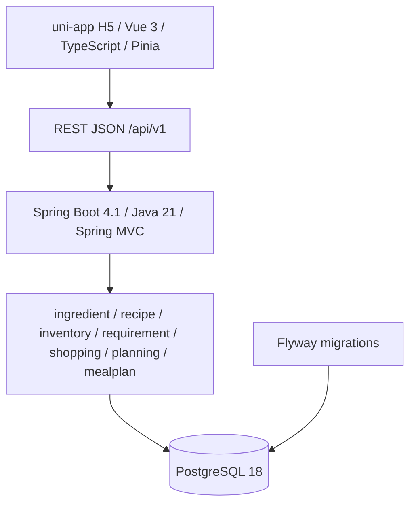

# MealOps V1 系统架构

## 文档目的

本文档同步至 Node 16：Plan-Derived Shopping Preview，记录当前模块边界、依赖方向和运行关系。

## 当前架构状态

当前能力链：

```text
Planning Preferences
        ↓
Hard Constraint Filter
        ↓
Eligible Recipe Candidates
        ↓
Pre-scale to defaultServings
        ↓
Greedy Slot-by-Slot Planner ── Node 14 Scorer / Ranker
        ↓
Select rank #1
        ↓
Simulate deduction in Rolling Accounting Inventory Snapshot
        ↓
Next Slot / repeat ranking
        ↓
Complete DRAFT MealPlan
        ↓
Explicit Confirm
```

Node 13 使用 `maxCookingMinutes` 与 `excludedIngredientIds` 进行纯 Java 硬约束过滤。Node 14 对 eligible candidates 评分：`defaultServings` 驱动 Recipe scaling，当前 accounting Inventory 产生逐食材覆盖率和缺口行数，再按 coverage DESC、shortage count ASC、estimated minutes ASC、recipe ID ASC 排序。Node 15 按日期和 BREAKFAST/LUNCH/DINNER 业务顺序处理 MealSlot；每个 Slot 都基于滚动的内存库存快照重新执行同一评分与排序，选择 rank 1 后以饱和到零的方式抵扣该 Recipe 需求，最终通过既有 MealPlan repository 持久化一个完整 DRAFT。该过程允许缺货和 Recipe 重复，不进行 MealType suitability 判断。Inventory DB 在整个生成过程中保持只读，不产生 reservation、consumption 或 InventoryTransaction。

Node 16 增加以下只读派生链路：

```text
Persisted MealPlan
        ↓
Stored Recipe Selections + Stored targetServings
        ↓
RecipeScaler
        ↓
Whole-plan Ingredient Requirements
        ↓
Current Accounting Inventory
        ↓
ShoppingListCalculator
        ↓
Shopping Preview
```

Planning Preferences 不进入 Node 16 计算；既有 MealPlan 的 stored `targetServings` 是事实来源。所有 Slot requirements 必须先聚合，再进行一次库存比较，以避免相同库存被多个 Slot 重复抵扣。Preview 使用请求时的实时 accounting Inventory，因此库存变化会改变结果，但 GET 本身不修改 MealPlan、Inventory、version 或 InventoryTransaction。

## 模块与依赖

MealOps 采用前后端分离的模块化单体：



Controller 只负责协议适配和输入校验；Application Service 负责用例编排和事务边界；Domain 包含可测试业务不变量；Infrastructure 负责 MyBatis 和显式 SQL。依赖方向为 API → Application → Domain，Infrastructure 通过端口适配 Application。

## MealPlan 边界

Node 12 持久化 MealPlan aggregate 和显式 MealSlot。计划窗口为 1～3 天，Slot 按日期及 BREAKFAST/LUNCH/DINNER 稳定排序。手动创建与 Node 15 自动构建均产生 DRAFT；DRAFT 支持全量替换，Confirm 要求所有 Slot 已分配 Recipe，DRAFT/CONFIRMED 可 Cancel。Node 16 允许完整 DRAFT 和 CONFIRMED 计划生成 Shopping Preview；不完整 DRAFT 返回 `MEAL_PLAN_INCOMPLETE`，CANCELLED 返回 `MEAL_PLAN_STATE_CONFLICT`。该预览不自动确认计划，也不执行 Inventory reservation/consumption。

## 基础设施与测试

Flyway 管理全部 schema migration，最新仍为 V6；Node 16 的 Shopping Preview 是派生结果，不创建 V7 或 Shopping persistence。数据库约束、事务、Mapper 和生命周期 SQL 使用真实 PostgreSQL 集成测试；Testcontainers 提供 PostgreSQL 18.4 测试实例。

V1 当前不存在 Redis、MQ、LLM、Agent 或前端工程实现。Node 15 Planner 是确定性的单步贪心构建器，不包含全局优化、回溯、beam search、随机性、学习排序或 Agent。

## 后续方向

后续节点可在真实产品需求支持时评估 Shopping persistence、purchase workflow、Inventory reservation/consumption、food-safety expiry policy、购物成本或包装优化。上述能力均不属于 Node 16；当前端点只返回基于实时 accounting Inventory 的临时缺口视图。
