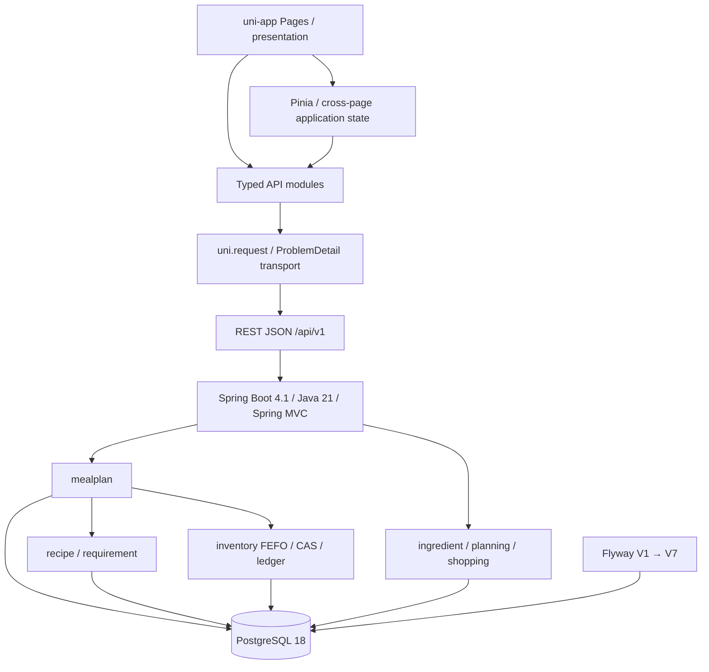

# MealOps V1 系统架构

## 文档目的

本文档同步至 Node 18：Frontend Engineering Baseline，记录当前前后端模块边界、依赖方向与运行关系。

## 当前能力链

```text
Planning Preferences
        ↓
Hard Constraint Filter → Candidate Scoring / Ranking
        ↓
Deterministic Multi-Meal Planner
        ↓
Persistent DRAFT MealPlan → Explicit Confirm
        ↓
Complete one PENDING MealSlot
        ↓
Stored Recipe Selection + targetServings
        ↓
RecipeScaler → Ingredient Requirements
        ↓
FEFO Allocation → Optimistic CAS → CONSUME Ledger
        ↓
MealSlot COMPLETED → final slot makes MealPlan COMPLETED
```

Node 13～15 负责确定性的过滤、评分、排序和逐餐贪心构建。Node 16 从持久化 MealPlan 派生只读购物预览。Node 17 第一次执行 MealPlan 驱动的库存写入：只有显式完成 CONFIRMED 计划中的 PENDING 餐槽才会扣减库存；Confirm 本身不扣库存。

## 模块与依赖



Controller 只负责协议适配和输入转换；Application Service 负责用例编排与事务；Domain 表达计划与餐槽状态不变量；Infrastructure 通过 MyBatis 与显式 SQL 实现端口。

## Frontend 边界

```text
┌────────────────────────────┐
│ uni-app Vue3 Frontend      │
│                            │
│ Pages                      │
│   ↓                        │
│ Pinia / Page State         │
│   ↓                        │
│ Typed API Modules          │
│   ↓                        │
│ uni.request HTTP Client    │
└─────────────┬──────────────┘
              │ REST / ProblemDetail
┌─────────────▼──────────────┐
│ Spring Boot Backend        │
└────────────────────────────┘
```

- Page 负责用户交互与呈现，不直接实现传输协议。
- Store 只保存跨页面应用状态，不提前集中承载未来领域数据。
- API module 表达单个后端 endpoint contract；Node 18 只实现 system health。
- HTTP client 只负责 `uni.request`、URL/query、2xx/204 与 ProblemDetail/网络错误，不弹 Toast、不导航、不自动重试。
- Backend 继续是所有业务状态与规则的事实来源。

一级导航由 `pages.json` 与 tabBar 定义，不引入 Vue Router。H5 开发代理只转发 `/api` 和 `/actuator`；微信小程序当前只保证编译兼容，真实合法域名与发布配置尚未确定。

## MealPlan 执行生命周期

- `DRAFT`：所有餐槽均为 `PENDING`，允许不完整和全量替换。
- `CONFIRMED`：所有餐槽均已分配 Recipe，允许 `PENDING` 与 `COMPLETED` 混合，但至少保留一个 `PENDING`。
- `COMPLETED`：所有餐槽均为 `COMPLETED`，不可取消。
- `CANCELLED`：保留取消时的餐槽执行状态，不进行库存反向恢复。

完成端点先用 PostgreSQL `FOR UPDATE` 锁定 MealPlan 父记录。同一计划的重复完成、不同餐槽完成与取消因此串行化。已完成餐槽的重试直接返回当前表示，不再次缩放 Recipe、不扣库存、不写流水。

## 事务与库存边界

餐槽完成在一个外层 `@Transactional` 用例内完成以下步骤：读取并锁定计划、读取一次 Recipe、缩放、聚合并确定性排序需求、逐食材执行 FEFO/CAS/流水、更新餐槽及计划状态。任一食材不足或并发 CAS 失败会回滚此前全部库存数量、version、流水与计划状态。

Node 8 的显式库存消费和 Node 17 共用 `InventoryConsumptionCoordinator`，避免复制 FEFO、乐观 CAS 与流水逻辑。没有使用 `REQUIRES_NEW`、best-effort、部分完成或自动重试。

## Shopping Preview

- 完整 DRAFT：计算全部 PENDING 餐槽。
- CONFIRMED：只计算 PENDING 餐槽，已完成餐槽不再进入需求。
- COMPLETED：返回 `200` 与空 items。
- 不完整 DRAFT：`MEAL_PLAN_INCOMPLETE`。
- CANCELLED：`MEAL_PLAN_STATE_CONFLICT`。

Preview 仍是派生、只读结果，不创建 Shopping persistence，也不修改库存。

## 基础设施与测试

Flyway 最新为 V7。V7 只为 `meal_plan_slot` 增加 execution status，并扩展 MealPlan status constraint；没有创建执行历史或预留表。数据库约束、事务、锁、Mapper 与并发行为使用 Testcontainers PostgreSQL 18.4 验证。

## 当前限制

当前没有 Inventory reservation、consume-on-confirm、completion undo/reversal、execution history、价格或食品安全策略。前端尚未实现 Inventory、Recipe、Planning 或 execution 业务 UI，也没有 authentication 或微信发布配置。V1 仍不存在 Redis、MQ、LLM 或 Agent；Node 19 尚未开始。
