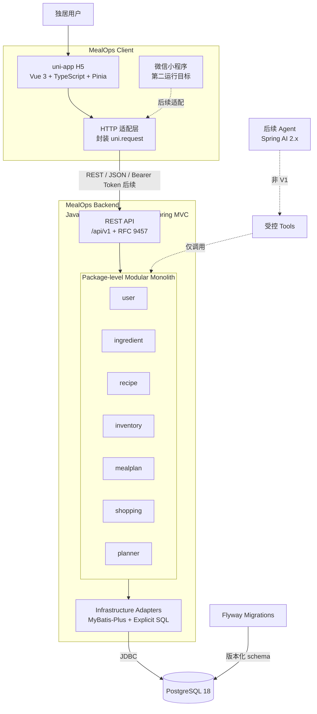
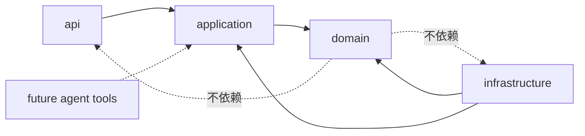

# MealOps V1 系统架构

## 1. 文档目的

本文描述 MealOps V1 当前架构、模块边界、依赖方向和运行关系，并同步至 Node 9 Ingredient Requirement Aggregation 的已实现边界。

本文不设计后续业务的数据模型、API 字段或 Planner 算法参数。节点 3 的 Ingredient 细节以 ADR 0008 和对应实现为准，尚未确认的后续细节继续保留到对应节点通过 ADR 决策。

## 2. V1 Context

当前状态：Node 9 Ingredient Requirement Aggregation 已实现并进入最终审查；流程为 Recipe Selection -> Recipe Scaling -> Ingredient Requirement Aggregation。库存比较、缺口、Shopping、Planner 和 MealPlan 尚未实现。

Node 8 在此基础上增加 `InventoryBatch -> FEFO Allocator -> optimistic CAS -> Inventory Transaction Ledger`；Node 9 只在需求侧增加 `Recipe -> RecipeScaler -> Requirement Aggregator`，不访问库存。

MealOps 面向独居用户，根据结构化菜谱、库存批次、保质期、偏好和未来 1～3 天的用餐时间槽，生成多个确定性餐食计划候选。用户确认计划后，系统聚合食材需求、模拟抵扣有效库存、生成购物清单，并在餐食完成、跳过或替换后维护计划和库存状态。

V1 的系统边界包括：

- 移动端优先 H5 用户界面；
- REST/JSON 后端 API；
- 模块化单体业务核心；
- PostgreSQL 18 数据库；
- Flyway schema migration；
- 使用真实 PostgreSQL 的自动化集成测试。

V1 明确不包含：

- Redis；
- 消息队列；
- LLM、RAG、向量数据库和 Agent；
- 微信登录与微信专属能力；
- 外卖、超市下单和支付；
- 独立微服务或 Maven 多业务模块。

## 3. 架构总览



实线表示 V1 架构内的关系；虚线表示已确定方向但不属于 V1 当前实现的能力。

## 4. Monorepo 边界

MealOps 使用一个 Git Monorepo 维护产品文档、后端、前端和本地基础设施。计划结构如下，但节点 1 不创建尚不存在的工程目录：

```text
MealOPS/
├── AGENTS.md
├── README.md
├── docs/
├── backend/       # 后续单一 Maven module
├── frontend/      # 后续 uni-app CLI/Vite 工程
└── infra/         # 后续本地基础设施定义
```

后端不是 Maven multi-module。模块化由 Java package、依赖方向、公共接口和测试维护，而不是先拆多个构建产物。

## 5. 后端技术基线

| 类别 | 基线 |
| --- | --- |
| Java | Java 21 LTS |
| 框架 | Spring Boot 4.1.x |
| Web | Spring MVC / Servlet |
| 构建 | Maven，单 backend module |
| 持久层 | MyBatis-Plus Boot 4 starter + 核心显式 SQL |
| 数据库 | PostgreSQL 18 |
| 迁移 | Flyway |
| API | REST + JSON + `/api/v1` |
| 错误 | RFC 9457 Problem Details + 稳定业务 `code` |
| 文档 | springdoc-openapi 3.x |
| 测试 | JUnit Jupiter 6 + AssertJ + Spring Boot Test + Testcontainers |
| 认证方向 | Spring Security + Bearer Token/JWT，后续节点设计 |

精确依赖 patch 版本只在创建工程时按官方兼容矩阵验证并固定，不在本文中声明动态依赖版本。

## 6. 前端技术基线

| 类别 | 基线 |
| --- | --- |
| 跨端框架 | uni-app CLI/Vite |
| UI 框架 | Vue 3 + TypeScript |
| 状态 | Pinia |
| HTTP | 封装 `uni.request`，不使用 Axios |
| 第一目标 | 移动端优先 H5 |
| 第二目标 | 微信小程序 |
| UI 组件库 | 暂不选择 |

前端只通过公开 REST API 使用后端能力，不复制库存、规划或购物核算规则。前端可做即时输入反馈，但后端始终负责最终业务校验。

## 7. 后端领域模块

### 7.1 `user`

负责 MealOps 内部用户身份、饮食偏好、过敏与忌口、可用厨具等用户范围数据。认证令牌细节在后续认证 ADR 中设计；微信 `openid` 不能成为业务核心用户标识。

### 7.2 `ingredient`

节点 3 当前负责标准食材身份、display name 和 normalized name。节点 4 在独立的 `measurement.domain` 中提供 Recipe、Inventory、Shopping 和 Planner 共用的 Dimension、Unit、Quantity 基础。节点 5 新增 `recipe` 模块，Recipe 通过 ingredient ID 引用标准食材，并在 aggregate 内保存 canonical base-unit Quantity；已实现 Create/Get 和 PostgreSQL 持久化。节点 6 增加纯 Domain `RecipeScaler`、`ScaledRecipe` 及只读 Scaling API；ScaledRecipe 不持久化，不包含 Inventory、Shopping 或 Planner。

### 7.3 `recipe`

负责结构化菜谱、份数、食材用量、步骤、时间、餐次与带饭属性。它引用标准食材，不自行维护另一套食材命名体系。

### 7.4 `inventory`

Node 7 的 `ingredient -> inventory batch -> canonical Quantity` 已由 Node 8 扩展为 `InventoryBatch -> FEFO Allocator -> optimistic CAS -> Inventory Transaction Ledger`。库存消费只使用同 ingredient、同 canonical unit 的批次；调整、接收、丢弃、幂等和版本之外的锁语义仍未实现。

负责库存批次、开封与到期状态、库存分配规则、实际消耗和库存流水。任何真实库存变化都必须可审计。

### 7.5 `mealplan`

负责用餐时间槽、计划候选引用、计划确认以及餐食完成、跳过、替换等状态。候选计算与持久计划事实必须区分。

### 7.6 `shopping`

负责聚合计划食材需求、模拟抵扣有效库存和生成缺失购物清单。生成清单不等于真实扣减库存。

### 7.7 `planner`

负责候选召回后的确定性硬约束过滤、评分、多餐组合搜索和解释。Planner 使用不可变输入快照，不直接通过 Mapper 修改库存或计划。

## 8. 模块化单体边界

- 每个业务模块拥有自己的业务模型、应用用例和持久化适配器；
- 模块只能通过对方明确公开的应用接口、查询接口或不可变数据契约协作；
- 禁止跨模块直接调用对方 Mapper 或修改对方数据库记录；
- 禁止跨模块复用对方 Controller DTO 作为领域模型；
- `common` 只能容纳真正跨域且稳定的技术约定，不能成为无归属业务代码的堆放区；
- 同一进程不代表可以忽略模块边界；
- 未来拆分服务必须基于真实扩缩、所有权或发布需求，不能作为 V1 目标。

建议的后端 package 轮廓为：

```text
com.xuhang.mealops
├── common
├── user
├── ingredient
├── recipe
├── inventory
├── mealplan
├── shopping
└── planner
```

每个模块内部按需要使用 `api`、`application`、`domain` 和 `infrastructure`，但不为没有相应职责的模块机械创建空目录或空接口。

## 9. 分层职责

### Controller / API

- 适配 HTTP、JSON、状态码和内容协商；
- 执行结构校验与认证上下文提取；
- 将 API DTO 转换为应用命令或查询；
- 将异常映射为 RFC 9457 Problem Details；
- 不包含业务规则、事务编排或数据库访问。

### Application

- 表达用户可观察的用例；
- 编排领域对象、模块端口和事务；
- 负责授权范围、幂等入口和跨聚合协调；
- 返回与协议和持久化实现解耦的结果；
- 是后续 Agent Tool 唯一允许调用的业务入口。

### Domain

- 保存实体、值对象、状态机和领域策略；
- 承载可独立测试的业务不变量与确定性算法；
- 不依赖 Spring MVC、MyBatis-Plus Wrapper、Controller DTO 或数据库实现；
- 规划、换算、批次分配等纯规则优先留在此层。

### Infrastructure

- 实现 Repository、Mapper、外部服务和时间等端口；
- 封装 MyBatis-Plus 与显式 SQL；
- 负责持久化映射，不重新实现业务规则；
- 不向 Domain 暴露框架类型。

## 10. 依赖方向



解释：

- API 依赖 Application；
- Application 编排 Domain，并通过端口表达所需基础设施；
- Infrastructure 实现 Application/Domain 定义的端口；
- Domain 保持对协议和持久化框架的独立；
- 后续 Agent Tools 只能调用 Application Service，不能调用 Mapper 或数据库。

具体是否使用接口反转应由可测试性和替换边界决定，不为每个类机械创建接口。

## 11. Transaction boundary 原则

- 写用例的事务边界由 Application Service 明确声明；
- Controller、领域策略和 Mapper 不负责跨记录事务编排；
- 一次业务动作涉及的状态变化、库存流水和幂等记录必须在同一必要事务中完成；
- 不在事务内调用不受控的远程服务；
- Planner 的候选搜索和评分优先基于不可变快照，在事务外完成可能较长的纯计算；
- 候选确认时重新校验依赖的库存或业务版本，并在短事务内持久化确认结果；
- 生成购物清单时的库存分配是模拟读取，不自动形成实际消耗；
- 并发控制与幂等的具体方案必须在相应节点通过 ADR 决定。

## 12. Flyway 的位置

后续后端工程中，Flyway migration 计划位于 backend 的标准 migration 资源目录。所有环境通过同一组版本化迁移建立 schema；不维护一份与迁移分离的手工建表脚本。

每个迁移必须：

- 与当前纵向节点的领域规则一致；
- 包含必要约束；
- 能从空 PostgreSQL 18 数据库按顺序执行；
- 经 Testcontainers 集成测试验证；
- 进入共享历史后通过新增迁移修正，不静默重写。

本文不规定任何表名或字段。

## 13. Testcontainers 的位置

Testcontainers 只作为测试依赖存在，不进入生产运行时。数据库集成测试启动真实 PostgreSQL 18，用于验证 Flyway、Mapper、显式 SQL、约束、事务、锁和幂等。

纯领域测试不启动 Spring 或容器。Controller 协议、应用装配和数据库行为分别选择与风险匹配的测试边界，不统一使用完整应用上下文。

## 14. 本地开发与部署边界

V1 开发阶段：

- Spring Boot 默认直接运行在本机 JVM，便于 IDE 调试；
- Docker Compose 后续只承载 PostgreSQL 等已批准基础设施；
- 前端开发服务器直接运行在本机；
- backend Dockerfile、前端生产构建与反向代理延后到部署节点；
- Redis 与 MQ 不出现在 V1 Compose 中。

Docker Compose 文件不在节点 1 创建。

## 15. 认证方向

后续认证节点使用 Spring Security，并面向 H5、微信小程序和可能的其他客户端提供 Bearer Token/JWT。业务数据始终关联 MealOps 内部 User ID。

以下内容尚未决定：

- Access Token 生命周期；
- Refresh Token 是否采用 JWT；
- Rotation、Reuse Detection 与撤销策略；
- Logout 语义；
- 签名算法与密钥管理；
- H5 初始登录标识。

这些事项必须在认证节点单独通过 ADR 决策，节点 1 不提前固化。

## 16. 后续 Agent 接入边界

Agent 不属于 V1。核心业务稳定后，预计使用 Spring AI 2.x，并遵循：

```text
Agent
  → Tool
    → Application Service
      → Domain
        → Repository Port
          → PostgreSQL
```

- Tool 只做协议适配和参数校验，不复制业务逻辑；
- Tool 不调用 Mapper，不执行 SQL；
- 写操作需要明确的用户确认策略；
- Agent 不得编造业务标识或绕过确定性 Planner；
- Agent Trace、工具评测和偏好记忆在后续节点分别设计。

## 17. 当前明确不存在的组件

下列组件不应出现在 V1 架构图、依赖或本地基础设施中：

- Redis 或其他缓存服务；
- Kafka、RabbitMQ、Redis Streams 或其他消息队列；
- LLM SDK、Spring AI、RAG 或向量数据库；
- Elasticsearch；
- 微服务网关、服务注册中心或分布式配置中心。

未来只有在真实性能、异步边界、搜索或 Agent 用例出现，并完成独立 ADR 后才能引入。

## 18. 待确认事项

- Java 21 的具体 OpenJDK 发行版与本地安装方式；
- Spring Boot 4.1.x、MyBatis-Plus 3.5.x、Flyway、Testcontainers 和 springdoc 3.x 的精确 patch 组合；
- 后端 package 边界的自动化架构测试方案；
- API 校验错误的 Problem Details 扩展结构；
- 认证令牌生命周期和密钥策略；
- Planner 算法、快照与并发校验细节；
- uni-app CLI 模板、前端测试框架和 UI 规范；
- 本地与 CI 的容器运行环境；
- 可量化性能和测试反馈时间目标。
