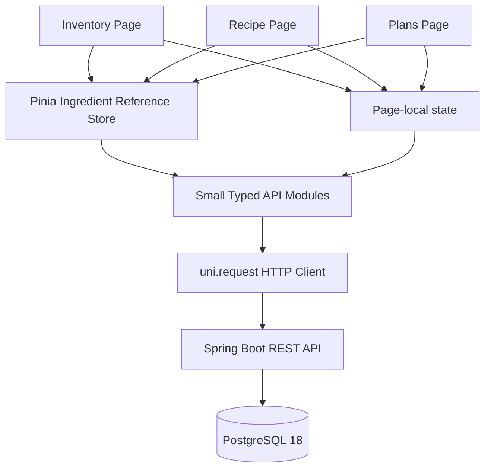

# MealOps V1 系统架构

## 文档目的

本文档同步至 Node 19 Foundational Domain Frontend Slices，记录当前前后端模块边界、依赖方向与运行关系。

## 当前能力与边界

后端仍是库存、菜谱、规划偏好、MealPlan 和购物预览的事实来源。Node 19 前端新增真实基础领域页面：

```text
Ingredient catalog
        ↓
Inventory batches
        ↓
Structured recipes
        ↓
Planning Preferences
```

这些页面通过现有 REST API 读写服务器状态，不实现业务计算。Node 20 的 MealPlan generation、Shopping Preview、Confirm、Cancel、Slot completion UI 尚未实现。

## Frontend 分层



- Ingredient catalog 同时被 Inventory、Recipe、Planning Preferences 使用，因此仅其引用状态进入 Pinia。
- Inventory、Recipe、Planning Preferences 的页面数据默认保留在页面本地，不建立巨大领域 Store。
- API module 只负责 endpoint contract；ProblemDetail 由 typed HTTP client 转换；页面负责 loading、empty、error 和成功反馈。
- mutation 成功后重新读取 server truth，不创建 fake optimistic entity。
- BigDecimal 数量在表单中保持字符串，前端不做单位换算、Recipe scaling 或业务算术。

## Backend Catalog Contract

- `GET /api/v1/ingredients` 返回 canonical Ingredient 的 bare JSON array，按 id 升序。
- `POST /api/v1/ingredients`、`GET /api/v1/ingredients/{id}`、`PUT /api/v1/ingredients/{id}` 支持创建、读取和重命名。
- `GET /api/v1/inventory/batches` 与 `POST /api/v1/inventory/batches` 仅表达当前可用库存批次。
- `GET /api/v1/recipes`、`POST /api/v1/recipes`、`GET /api/v1/recipes/{id}` 表达完整结构化菜谱及有序食材/步骤。
- `GET /api/v1/planning-preferences` 与 `PUT /api/v1/planning-preferences` 读写 singleton 偏好；`maxCookingMinutes: null` 表示不限时。

Backend 继续负责校验、事务、单位 canonicalization、Problem Details 和所有业务不变量。前端不使用 candidate、ranking、Planner、Shopping 或 MealPlan endpoint 作为基础领域数据源。

## 工程约束

Node 19 不修改 backend、Flyway migration 或 Compose 数据库契约。最新 migration 仍为 V7。前端不使用 Axios、Vue Router、UI library、OpenAPI codegen、认证、Redis、MQ 或 Agent。
